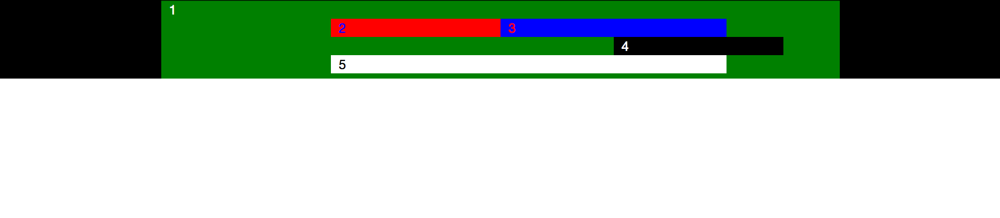

부스트랩의 그리드 시스템을 연습해보자
=====================================

부트스트랩 그리드 시스템을 이용하여 총 5개의 div를 만들어서 사진과 같은 모양 만들어 
그리드 시스템에 대한 이해와 활용법 습득

### 조건

1. 어떠한 에디터로도 작성 가능
2. col-md-offset-*과 col-md-*을 사용하여 작성
3. 박스와 텍스트의 색은 사진과 일치하게 작성해야 한다.
4. 프랙티스는 작성 완료 후 각자의 github repository에 올리도록 한다.

### 예시
